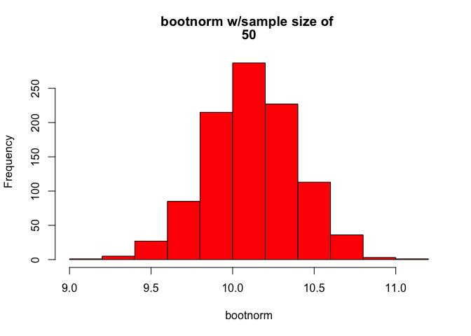
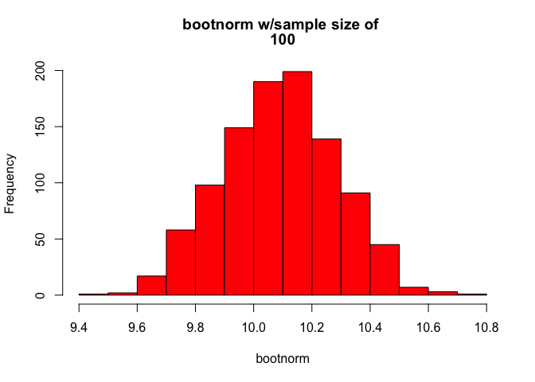
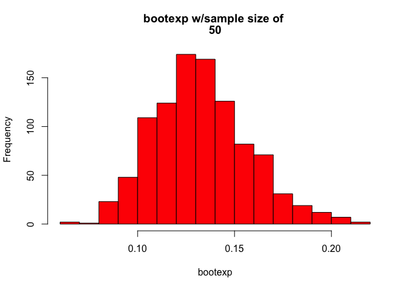
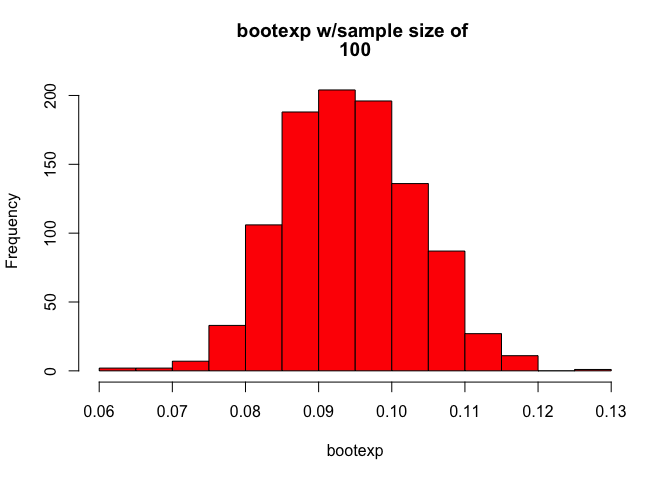

# Homework4_bootstrap
Peter Byrd  
October 13, 2016  


## Homework 4 - Bootstrap code

This is the bootstrap code for Homework 4.  It includes the code for 4 samples, two random normal samples of 50 and 100, and two random exponential samples of 50 and 100.

# Normal sample with sample size of 50


```r
# Normal distribution with sample size = 50
#
samp <-50          # sample size
iter <-1000        # number of iterations to run
x <- rnorm(samp,10,2)
xbar <- mean(x)
x_sd <- sd(x)
# Initialize variables
bootnorm <- numeric(iter)
bootsd <- numeric(iter)
# Run iterations and build vector with mean and sd of each sample
for (i in 1:iter) {
  bootsamp <- sample(x,size=samp,replace=TRUE)
  bootnorm[i] <- mean(bootsamp)
  bootsd[i] <- sd(bootsamp)
}
# Report results of original sample versus all bootstrap samples
xbar            # Original Mean
```

```
## [1] 10.11892
```

```r
x_sd            # Original Standard Deviation
```

```
## [1] 2.068769
```

```r
mean(bootnorm)  # Average of sample Mean
```

```
## [1] 10.122
```

```r
mean(bootsd)    # Average of sample Standard Deviation
```

```
## [1] 2.044612
```

# Histogram of the bootnorm data with the sample size of 50.

<!-- -->

You can see that the bootnorm sample has a relatively normal distribution, thus supporting the central limit theorem.


# Normal sample with sample size of 100


```r
# Normal distribution with sample size = 100
samp <-100         # sample size
iter <-1000        # number of iterations to run
x <- rnorm(samp,10,2)
xbar <- mean(x)
x_sd <- sd(x)
# Initialize variables
bootnorm <- numeric(iter)
bootsd <- numeric(iter)
# Run iterations and build vector with mean and sd of each sample
for (i in 1:iter) {
  bootsamp <- sample(x,size=samp,replace=TRUE)
  bootnorm[i] <- mean(bootsamp)
  bootsd[i] <- sd(bootsamp)
}
# Report results of original sample versus all bootstrap samples
xbar            # Original Mean
```

```
## [1] 10.08867
```

```r
x_sd            # Original Standard Deviation
```

```
## [1] 1.931374
```

```r
mean(bootnorm)  # Average of sample Mean
```

```
## [1] 10.08801
```

```r
mean(bootsd)    # Average of sample Standard Deviation
```

```
## [1] 1.908887
```

# Histogram of the bootnorm data with the sample size of 100.

<!-- -->

You can see that the bootnorm sample has a relatively normal distribution, thus supporting the central limit theorem.

# Exponential sample with sample size of 50


```r
# Exponential distribution with sample size = 50
#
samp <-50          # sample size
iter <-1000        # number of iterations to run
x <- rexp(samp,10)
xbar <- mean(x)
x_sd <- sd(x)
# Initialize variables
bootexp <- numeric(iter)
bootsd <- numeric(iter)
# Run iterations and build vector with mean and sd of each sample
for (i in 1:iter) {
  bootsamp <- sample(x,size=samp,replace=TRUE)
  bootexp[i] <- mean(bootsamp)
  bootsd[i] <- sd(bootsamp)
}
# Report results of original sample versus all bootstrap samples
xbar            # Original Mean
```

```
## [1] 0.1340442
```

```r
x_sd            # Original Standard Deviation
```

```
## [1] 0.1804561
```

```r
mean(bootexp)   # Average of sample Mean
```

```
## [1] 0.1327416
```

```r
mean(bootsd)    # Average of sample Standard Deviation
```

```
## [1] 0.1724955
```

# Histogram of the bootexp data with the sample size of 50.

<!-- -->

You can see that the bootexp sample has a relatively normal distribution, thus supporting the central limit theorem.


# Exponential sample with sample size of 100


```r
# Exponential distribution with sample size = 100
#
samp <-100         # sample size
iter <-1000        # number of iterations to run
x <- rexp(samp,10)
xbar <- mean(x)
x_sd <- sd(x)
# Initialize variables
bootexp <- numeric(iter)
bootsd <- numeric(iter)
# Run iterations and build vector with mean and sd of each sample
for (i in 1:iter) {
  bootsamp <- sample(x,size=samp,replace=TRUE)
  bootexp[i] <- mean(bootsamp)
  bootsd[i] <- sd(bootsamp)
}
# Report results of original sample versus all bootstrap samples
xbar            # Original Mean
```

```
## [1] 0.09419845
```

```r
x_sd            # Original Standard Deviation
```

```
## [1] 0.08920019
```

```r
mean(bootexp)  # Average of sample Mean
```

```
## [1] 0.09425001
```

```r
mean(bootsd)    # Average of sample Standard Deviation
```

```
## [1] 0.0879894
```

# Histogram of the bootexp data with the sample size of 100.

<!-- -->

You can see that the bootexp sample has a relatively normal distribution, thus supporting the central limit theorem.

# End of homework
